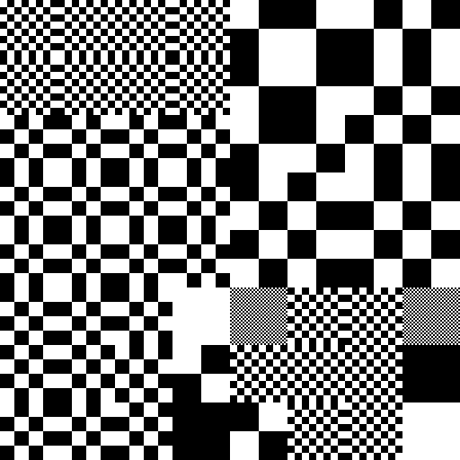

# sketches_checkerboard 不只是棋盘格

  
[c_XOR_3_I/examples/data_9134.png](c_XOR_3_I/examples/data_9134.png)

  
[checkerboard_cell_complementary/examples/data_4726.png](checkerboard_cell_complementary/examples/data_4726.png)

  
[checkerboard_cell_interaction/examples/data_7179.png](checkerboard_cell_interaction/examples/data_7179.png)

从画棋盘格开始探索，已有多种不同图案可用于画图，也发现了不同的分形。

使用 `Processing 4.3.2` 写的代码。

## 灵感来源

主要是 2026 年 1 月份自己用画图软件画的 [black_white_1.png](why_start_the_repo/black_white_1.png)

把小方格尺寸倍增的棋盘格图案拼在一起，边界十分整齐，有独特的美感。

以及从之前自己写的代码受到的启发。

[详细的灵感来源](why_start_the_repo/inspiration.md)

## 目前代码

运行方式：先 Git 克隆仓库，或者下载 zip 压缩包，自行解压缩。如无特别说明，下载之后，用 Processing 4 直接打开运行即可。

### 画棋盘格

棋盘格不难画，于是想着打包成函数，想在哪里画就能在哪里画，而且能画出不同小方格尺寸 `a` 对应的棋盘格。

- `checkerboard_1.pde`：矩形区域里面画棋盘格，由黑白小方格组成

- `checkerboard_2.pde`：棋盘格的推广，小格子长宽不等，也不用 `a` 表示，留着备用

其中边界部分画不下一个完整的格子，有两种处理方式：空着，或者画满边界为止。

后续的代码选择了画满边界为止。

### 用棋盘格画图

既然能画在任意位置，就能看作一个带棋盘格图案花纹的、可以任意放置的矩形区域，**把不同图案的矩形铺在画布上，就能得到千变万化的图形**。

怎么得到不同图案呢？在画图案的函数里面放几个可变参数，调用的时候，代入不同值即可。

这里我们把小方格尺寸 `a` 作为可变参数，画出不同疏密程度的棋盘格图案，从密集得灰蒙蒙一片到整个矩形只有一个格子为止。

每个矩形代入的 `a` 值不尽相同，怎么确定？

恰好每个矩形位置不同，取位置坐标（`x`，`y`），找个公式计算一下，就能得到 `a` 值。而这里的矩形都是按网格整齐排列的，从而 `x`，`y` 可以简化成从 0 开始的列、行序数。

公式有了，难道现画现算？如果计算很麻烦呢？能不能**把计算的部分与画图的部分分开？**

明显可以。于是先把各矩形对应数值计算好，放二维列表 `data` 里面，需要时再读取，既可以直接作为 `a` 值代入，也可以先进一步处理。

`a` 的值取 2 的整数次幂 1，2，4，8，16，……时画出的棋盘格排列在一起很整齐，只是如果直接计算，公式稍显复杂，就拆成了两部分，先用 `x`、`y` 值算出整数保存起来，画图时再取：
```Processing
a = int(pow(2, data[y][x]))
```
代入参数。实际操作时不需要显示写出这一行，直接代入参数即可。

- `checkerboard_cell_1.pde`：4x4 网格区域，`data[y][x] = x + y`

- `checkerboard_cell_2.pde`：8x8 网格区域，`data[y][x] = x ^ y`

既然数据可以预先算出，就可以**从外部文件读取，或者保存为文件**：

- `checkerboard_cell_with_load_data.pde`：演示加载外部数据，即 `data[y][x]` 来源于文本文件。

- `checkerboard_cell_with_save_data.pde`：演示保存数据为文本文件。

进一步地，为什么不能**借助交互，在画布上实时改变图案**：

- `checkerboard_cell_interaction.pde`：点一下鼠标左键/右键，改变区域里面的棋盘格外观，看用不同图案能拼接出什么。按 `s` 键保存数据、图形，`r` 键重置画布。

如果你把画布调得太大，尽管优化了一下，重置画布的时候还是要等一下；而且部分区域可能就点不到了，从而得到的图片比较空不好看；此外画到后面可能有点眼花缭乱。

注意**没有撤回功能**。

### 拆分代码

把 `checkerboard_cell_interaction.pde` 的代码整理一下，拆分出类，**便于复用**，尽管目前的代码仍然很简陋：

- `checkerboard_cell_interaction_2`：包括 4 份代码
  - `checkerboard_cell_interaction_2.pde`：主代码，画图
  - `Grid.pde`：定义 `Grid` 类，数据存取，更新，重置
  - `Pattern.pde`：定义图案模式的抽象类 `Pattern`，其余图案类继承自这个类，重写 `display` 方法，调用即可画图。
  - `CheckerboardPattern.pde`：定义新类 `CheckerboardPattern`，继承 `Pattern` 抽象类，图案的具体实现。

使用抽象类是受 DeepSeek 启发。

这样实现新图案只需从 `Pattern` 类继承一个新类，选取合适参数，把画图案的代码打包成子类的 `display` 方法，然后在画图的地方，实例化子类，调用 `display` 方法即可；只换图案，只需改变子类，确定好参数，其余代码不变。

如果从头开始画各种图案，也想要类似的交互方式，先保存草图，然后用 Processing 4 里面自带的添加文件功能，**把需要的代码添加进来，就可以专注于不同图案怎么画了**。

同时加上了 `checkerboard_cell_with_load_data.pde` 演示的加载外部数据的功能。

能不能扩展到负数？

- `checkerboard_cell_complementary`：包括 5 份代码
  - `checkerboard_cell_complementary.pde`：主代码，画图
  - `Grid.pde`：定义 `Grid` 类，数据存取，更新，重置
  - `Pattern.pde`：定义图案模式的抽象类 `Pattern`
  - `CheckerboardPattern.pde`：画棋盘格的方法
  - `CheckerboardPattern2.pde`：画黑白互补的棋盘格的方法

数据范围从原来的 `0` 到 `dataMax` 之间扩展为 `-dataMax-1` 到 `dataMax` 之间，扩展了能画出的图形范围，代码结构也开始触及其中独特的美——这种美有两重，代码结构对称互补，能表示的图形也是对称互补的；而且代码结构触及二进制、补码、按位取反。

使用方式类似：点一下鼠标左键/右键，改变区域里面的棋盘格外观，看用不同图案能拼接出什么。按 `s` 键保存数据、图形，`r` 键重置画布。

### 画棋盘格也可用位运算

把棋盘格看作网格填格子，则每个格子 `x`、`y` 坐标的二进制表示，最后一位按位异或的结果恰好是棋盘格的结构

- `c_XOR.pde`：棋盘格的本质是异或？按位异或画棋盘格。此外为了少打字母就把 checkerboard 简写成 c。

**注意从这里开始，画出的棋盘格左上角通常是黑色的，不像前面的代码，画出的棋盘格左上角通常是白色的。**

### 多取几位，就像把不同棋盘格组合在一起了

`c_XOR.pde` --引入索引值 `a` 多取几位--> `c_XOR_2.pde`

先计算按位异或 `x ^ y` ，再取 `a` 补码中所有 `1` 对应的位，这些位只要有 `1`，结果就是 `1`，填充白色，全 `0`，得 `0`，填充黑色。

已经发现：`a` 等于 `1` 即 `c_XOR.pde` 画的情形，`a` 取 2 的幂，画出不同小方格尺寸的棋盘格，其余情况，看起来就像把不同棋盘格组合在一起了。部分 `a` 值能画出嵌套、层次、分形。

使用方式：点鼠标改变 `a` 值看不同图形，其中左键加 1 右键减 1。可以对照控制台输出值与画出的图形。按 `s` 键保存图片。

### 不同的位运算，画出的不只是棋盘格

`c_XOR_2.pde` --按位异或换成按位与--> `c_AND_2.pde`  
`c_XOR_2.pde` --按位异或换成按位或--> `c_OR_2.pde`

已经发现：随着索引值 `a` 变化也有相应的嵌套、层次、分形图形。

使用方式：点鼠标改变 `a` 值看不同图形，其中左键加 1 右键减 1。可以对照控制台输出值与画出的图形。按 `s` 键保存图片。

#### 预料之外的分形

`c_AND_2.pde` 中，`a` 二进制表示的低位有一串 `1` 的时候，能画出类似谢尔宾斯基三角形的图形，只是与谢尔宾斯基三角形从正三角形开始不同的是，这里从等腰直角三角形开始，不妨试一试。

发现了两种方式能得到一串 `1`，都是不断迭代 `a` 的值。分别整理成代码：

`c_AND_2.pde` --> `c_AND_2a.pde`  
`c_AND_2.pde` --> `c_AND_2b.pde`

`c_AND_2a.pde` 从最细节开始构建，点阵从小到大；`c_AND_2b.pde` 从最大的空白开始，点阵从大到小。为了尽可能充分利用画布，选取的 `a` 值最终以 `1` 结尾。

使用方式：点几下鼠标，对照控制台输出值与画出的图形，看一看这种图形怎么得到的。按 `s` 键保存图片。

### 更多图案画图

- `c_XOR_3_I.pde`：`c_XOR_2.pde` 的图案，复用并稍微调整 `checkerboard_cell_interaction_2` 的结构，索引值 `a` 当图案参数用，扩展了参数值的范围，也在棋盘格的基础上多出不少图案可用。

`I` 指类似于 `checkerboard_cell_interaction_2` 等草图的代码结构和交互方式。

使用方式类似：点一下鼠标左键/右键，改变区域里面的图案外观，看用不同图案能拼接出什么。按 `s` 键保存数据、图形，`r` 键重置画布。

## 关于Processing

Processing 是一种开源的编程语言，也是一个开发环境，与多种常见的编程语言的区别是，输入代码就能直接画出各种想要的图形。默认 Java 模式。详见官网：[https://processing.org](https://processing.org)

根据其项目地址 [https://github.com/processing/processing4](https://github.com/processing/processing4)，Processing 4 的许可证信息：

- 核心库遵循 [LGPLv2.1](https://www.gnu.org/licenses/old-licenses/lgpl-2.1.html) 许可证
- Processing 开发环境遵循 [GPLv2](https://www.gnu.org/licenses/old-licenses/gpl-2.0.html) 许可证

如果只是用 Processing 作为工具创作的代码，一般可以自由选择许可证

## 运行环境

建议使用 `Processing 4.3.2` 或更高版本。没有在其他版本上测试，不保证能在每个版本上正常运行。

Processing 最新版本下载地址：[https://processing.org/download](https://processing.org/download)

下载特定版本：[https://github.com/processing/processing4/releases](https://github.com/processing/processing4/releases)

## 许可证

本代码仓库采用 MIT 许可证。详见 [LICENSE](LICENSE)。
