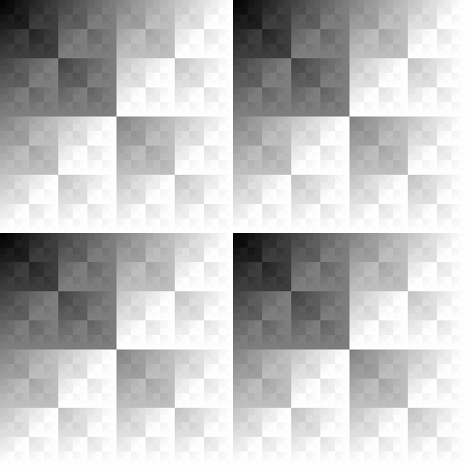

# sketches_checkerboard 不只是棋盘格

  简体中文 | <a href="README_en.md">English</a>

  
[bitwise/c_bitwise_3/examples/c_bitwise_3_OR_a_255_11111111.png](bitwise/c_bitwise_3/examples/c_bitwise_3_OR_a_255_11111111.png)

  
[interactive_drawing/c_XOR_3_I_C/examples/example1.png](interactive_drawing/c_XOR_3_I_C/examples/example1.png)

从画棋盘格开始探索，已有多种不同图案可用于画图，也发现了不同的分形。

## 目前草图

### checkerboard 棋盘格

画棋盘格的函数；拼在一起，形成更大、更复杂的图案。

### interactive_drawing 点击鼠标画图

点一下鼠标看一看你能画出什么。不同草图支持的图案类型有所不同，而且有些草图能画黑白互补的图案。

此外代码被拆分过，便于复用。

### bitwise 位运算

棋盘格的本质是按位异或？其他位运算呢？

位运算画分形？

位运算结果直接当颜色用，有一种复杂而独特的美。

**注意：`/docs` 里面没有草图！**

## 运行方式

各草图开箱即用，互不依赖，唯一需要的就是 Processing。

建议使用 `Processing 4.3.2` 或更高版本；没在其他版本上测试过不保证能运行。

## 关于Processing

详见官网：[https://processing.org](https://processing.org)

下载地址：[https://processing.org/download](https://processing.org/download)

## 许可证

如无特别说明，许可方式如下：

- 代码：MIT 许可证。详见 [LICENSE](LICENSE)。
- 文档，示例数据和图片：[CC BY 4.0](https://creativecommons.org/licenses/by/4.0/)。
