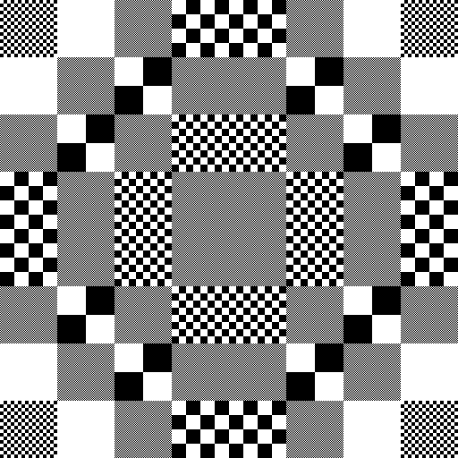

# sketches_checkerboard 棋盘格

  
[checkerboard_cell_interaction/examples/data_7179.png](checkerboard_cell_interaction/examples/data_7179.png)

把画布分成网格区域，每个区域对应一个数字，根据数字大小填上棋盘格，或密集或稀疏。

使用 `Processing 4.3.2` 写的代码。

## 灵感来源

主要是 2026 年 1 月份自己用画图软件画的 [black_white_1.png](why_start_the_repo/black_white_1.png)

以及从之前自己写的代码受到的启发。

[详细的灵感来源](why_start_the_repo/inspiration.md)

## 目前代码

- `checkerboard_1.pde`：画棋盘格

- `checkerboard_2.pde`：棋盘格的推广，小格子长宽不等，留着备用

- `checkerboard_cell_1.pde`：把画布分成 4x4 网格区域，每个区域按照坐标（`x`，`y`）对应数字 `data[y][x] = x + y`，再画小格子边长 `a = int(pow(2, data[y][x]))` 的棋盘格。

- `checkerboard_cell_2.pde`：8x8 网格区域，`data[y][x] = x ^ y`

- `checkerboard_cell_with_load_data.pde`：演示加载外部数据，即 `data[y][x]` 来源于文本文件。

- `checkerboard_cell_with_save_data.pde`：演示保存数据为文本文件。

- `checkerboard_cell_interaction.pde`：点一下鼠标改变区域里面的棋盘格外观，看能不能用不同疏密的棋盘格画出什么图案

## 使用方式

一般地，用 Processing 4 打开直接运行即可。

对`checkerboard_cell_with_interaction.pde`，打开之后，点击鼠标左键、右键试一试，看一看能不能用棋盘格画出什么东西；按下 `s` 键保存数据和当前画布，按下 `r` 键重置画布，可能要稍等一下。

`checkerboard_cell_with_interaction.pde` 的默认画布大小是 512x512 像素，如果调太大了，最底下的部分点不到，尽管保存图片不受影响，看起来却是空的不太美观，而且画到后面有可能会看起来眼花缭乱。注意没有撤回功能。

这里所有区域都是相同大小的，且区域宽度 `W = width / w`，区域高度 `H = height / h`。

## 关于Processing

Processing 是一种开源的编程语言，也是一个开发环境，与多种常见的编程语言的区别是，输入代码就能直接画出各种想要的图形。默认 Java 模式。详见官网：[https://processing.org](https://processing.org)

根据其项目地址 [https://github.com/processing/processing4](https://github.com/processing/processing4)，Processing 4 的许可证信息：

- 核心库遵循 [LGPLv2.1](https://www.gnu.org/licenses/old-licenses/lgpl-2.1.html) 许可证
- Processing 开发环境遵循 [GPLv2](https://www.gnu.org/licenses/old-licenses/gpl-2.0.html) 许可证

如果只是用 Processing 作为工具创作的代码，一般可以自由选择许可证

## 运行环境

建议使用 `Processing 4.3.2` 或更高版本。没有在其他版本上测试，不保证能在每个版本上正常运行。

Processing 最新版本下载地址：[https://processing.org/download](https://processing.org/download)

下载特定版本：[https://github.com/processing/processing4/releases](https://github.com/processing/processing4/releases)

## 许可证

本代码仓库采用 MIT 许可证。详见 [LICENSE](LICENSE)。
