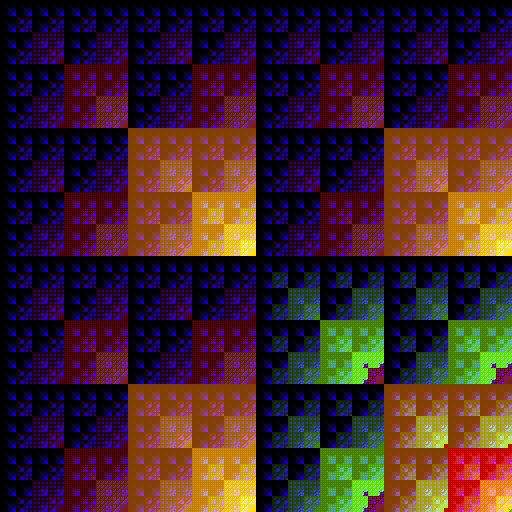
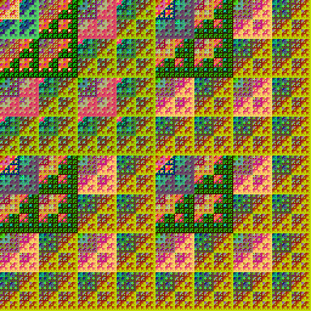
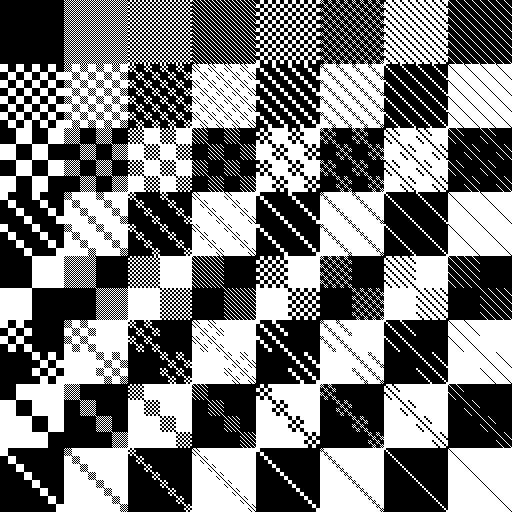

# sketches_checkerboard: More Than Checkerboard

  <a href="README.md">简体中文</a> | English

  
[bitwise/c_bitwise_9/examples/c_bitwise_9_AND_a_-7952_xOffset_98304_yOffset_32768_s20260223235338_784861_49976.png](bitwise/c_bitwise_9/examples/c_bitwise_9_AND_a_-7952_xOffset_98304_yOffset_32768_s20260223235338_784861_49976.png)

  
[bitwise/c_bitwise_9/examples/c_bitwise_9_OR_a_-7764_xOffset_67584_yOffset_33792_s20260223234735_421814_26819.png](bitwise/c_bitwise_9/examples/c_bitwise_9_OR_a_-7764_xOffset_67584_yOffset_33792_s20260223234735_421814_26819.png)

  
[interactive_drawing/c_XOR_3_I_C/examples/example1.png](interactive_drawing/c_XOR_3_I_C/examples/example1.png)

Start with checkerboard, discover patterns for drawing, and even some fractals.

## Sketches Here

### checkerboard

Simple functions draw checkerboard pattern; place different checkerboards together to form larger, more complex pictures.

### interactive_drawing

Click the mouse to see what you can draw. Patterns available may differ between sketches, and some sketches also support complementary patterns.

Besides, source code has been modularized for reuse.

### bitwise

Is the nature of checkerboard bitwise XOR? What about other bitwise operators?

Bitwise fractals?

Result of bitwise operations used as color, a unique kind of beauty emerges.

**Note: no sketches in `/docs`!**

## How to Run These Sketches

All sketches can run individually. Processing required only. 

`Processing 4.3.2` or higher is recommended; sketches are not tested on other versions and no warranty whether they can run.

## About Processing

Details can be found on its homepage: [https://processing.org](https://processing.org)

Where to download: [https://processing.org/download](https://processing.org/download)

## License

Unless specified elsewhere, the licenses are listed as below:

- Source code: MIT license. See [LICENSE](LICENSE).
- Docs, example data and images: [CC BY 4.0](https://creativecommons.org/licenses/by/4.0/).
